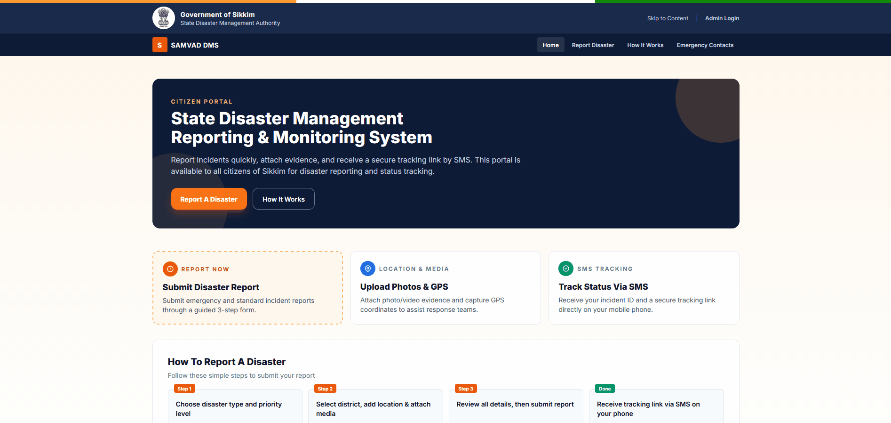

<div align="center">

# 🚨 Disaster Management & Reporting System 


**A full-stack, open-source platform for real-time disaster incident reporting, tracking, and resolution**

[](https://dotnet.microsoft.com)
[](LICENSE)
[](CONTRIBUTING.md)
[]()

[Features](#-features) • [Getting Started](#-getting-started) • [Architecture](#-architecture) • [API Docs](#-api-documentation) • [Contributing](#-contributing)

<br/>



</div>

---

## �️ Screenshots

| Citizen Portal | Admin Dashboard |
|---|---|
|  |  |

---

## �📖 Overview

Gov-DMS is a production-ready **Disaster Management System** that enables citizens to report disaster incidents — such as landslides, floods, fires, and earthquakes — without requiring an account. Reports are geotagged, support media uploads, and generate a unique tracking token so citizens can monitor resolution progress via SMS.

Administrators get a full-featured dashboard with analytics, incident management workflows, district-level oversight, and automated SMS/email notifications.

> **Built for real-world government and NGO use** — designed to work at scale with a clean, maintainable codebase.

---

## ✨ Features

### 👤 For Citizens (No Login Required)
- **Anonymous incident reporting** — submit reports without creating an account
- **GPS location capture** — precise geolocation with manual fallback text
- **Media uploads** — attach up to 5 photos/videos per report (up to 20MB each)
- **Disaster categories** — Landslide, Flood, Fire, Earthquake, Road Blockage, and more
- **SMS tracking token** — receive a unique token to track your report status anytime
- **Real-time status tracking** — check report progress: Open → In Progress → Closed

### 🛡️ For Administrators
- **Analytics dashboard** — live incident counts, trends, district heatmaps
- **Incident management** — view, assign priority, update status, add internal comments
- **District-based filtering** — manage incidents scoped to specific districts
- **User management** — create/manage admin accounts with role-based access control
- **Audit logging** — complete trail of all administrative actions
- **Notification management** — configure and dispatch SMS & email alerts

### ⚙️ Technical Highlights
- **JWT authentication** with configurable token expiry
- **Rate limiting** to prevent API abuse
- **Swagger/OpenAPI** documentation for the REST API
- **Clean Architecture** — easily testable, swappable, maintainable
- **SMS & Email service abstractions** — plug in any provider

---

## 🏗️ Architecture

This project follows **Clean Architecture** principles, ensuring separation of concerns and long-term maintainability.

```
┌──────────────────────────────────────────────────┐
│                  Presentation                    │
│        SAMVAD.DMS.Api  │  SAMVAD.DMS.Web         │
├──────────────────────────────────────────────────┤
│                  Application                     │
│     SAMVAD.DMS.Application  (Services, DTOs)     │
├──────────────────────────────────────────────────┤
│     Infrastructure      │     External Services  │
│  SAMVAD.DMS.Infrastructure  │  Email  │  SMS    │
├──────────────────────────────────────────────────┤
│                    Domain                        │
│        SAMVAD.DMS.Domain  (Entities, Enums)      │
└──────────────────────────────────────────────────┘
```

| Project | Purpose |
|---|---|
| `SAMVAD.DMS.Domain` | Core entities, enums, domain interfaces — zero dependencies |
| `SAMVAD.DMS.Application` | Business logic, DTOs, service interfaces |
| `SAMVAD.DMS.Infrastructure` | EF Core, SQL Server, repository implementations |
| `SAMVAD.DMS.Api` | REST API with JWT auth, Swagger, rate limiting |
| `SAMVAD.DMS.Web` | MVC web frontend for citizens and administrators |
| `SAMVAD.DMS.Email` | Pluggable SMTP email notification service |
| `SAMVAD.DMS.SMS` | Pluggable SMS gateway notification service |
| `SAMVAD.DMS.Shared` | Shared models and response wrappers |
| `SAMVAD.DMS.External` | Third-party service integrations |

---

## 🛠️ Tech Stack

| Layer | Technology |
|---|---|
| **Backend API** | ASP.NET Core 8, C# 12 |
| **Frontend** | ASP.NET Core MVC, Razor Views |
| **Database** | SQL Server (EF Core 8, Code First) |
| **Authentication** | JWT Bearer Tokens |
| **API Docs** | Swagger / OpenAPI |
| **Notifications** | SMTP Email + HTTP SMS Gateway |
| **Security** | Rate Limiting, RBAC, Audit Logging |

---

## 🚀 Getting Started

### Prerequisites

- [.NET 8 SDK](https://dotnet.microsoft.com/download/dotnet/8.0)
- [SQL Server](https://www.microsoft.com/en-us/sql-server/sql-server-downloads) (Express or higher)
- Git

### 1. Clone the repository

```bash
git clone https://github.com/lochan717/Gov-Disaster-Reporting-System.git
cd Gov-Disaster-Reporting-System
```

### 2. Configure the API

```bash
cp SAMVAD.DMS.Api/appsettings.Development.example.json SAMVAD.DMS.Api/appsettings.Development.json
```

Edit `SAMVAD.DMS.Api/appsettings.Development.json` and fill in your values:

```json
{
  "ConnectionStrings": {
    "DefaultConnection": "Server=.\\SQLEXPRESS;Database=SAMVAD_DMS;..."
  },
  "Jwt": {
    "Key": "your-secret-key-at-least-32-characters-long"
  }
}
```

### 3. Configure the Web App

```bash
cp SAMVAD.DMS.Web/appsettings.Development.example.json SAMVAD.DMS.Web/appsettings.Development.json
```

### 4. Apply Database Migrations

```bash
cd SAMVAD.DMS.Api
dotnet ef database update
```

### 5. Run the Application

Open two terminals:

```bash
# Terminal 1 — API
cd SAMVAD.DMS.Api
dotnet run
# Runs on https://localhost:7001

# Terminal 2 — Web Frontend
cd SAMVAD.DMS.Web
dotnet run
# Runs on https://localhost:7002
```

Or open `SAMVAD.DMS.sln` in **Visual Studio** and use the multi-project launch profile.

---

## 📋 API Documentation

Once the API is running, visit:

```
https://localhost:7001/swagger
```

Swagger UI provides interactive documentation for all endpoints, including:

| Group | Endpoints |
|---|---|
| `Incidents` | `POST /api/incidents/public` · `GET /api/incidents` · `PUT /api/incidents/{id}/status` |
| `Authentication` | `POST /api/authentication/login` |
| `Dashboard` | `GET /api/dashboard/stats` |
| `Districts` | `GET /api/districts` |
| `Users` | `GET /api/users` · `POST /api/users` |
| `Notifications` | `GET /api/notifications` |

---

## 🔧 Configuration Reference

| Key | Description | Required |
|---|---|---|
| `ConnectionStrings:DefaultConnection` | SQL Server connection string | ✅ |
| `Jwt:Key` | JWT signing key (min 32 chars) | ✅ |
| `Jwt:Issuer` | JWT issuer name | ✅ |
| `Jwt:ExpiryHours` | Token lifetime in hours | ✅ |
| `Email:SmtpHost` | SMTP server hostname | Optional |
| `Email:SmtpUsername` | SMTP credentials | Optional |
| `Sms:GatewayUrl` | SMS provider API endpoint | Optional |
| `Sms:ApiKey` | SMS provider API key | Optional |
| `FileStorage:MaxFileSizeMb` | Max upload size per file | Optional |

SMS and Email services are disabled by default (`"Enabled": false`) and can be toggled independently.

---

## 📂 Project Structure

```
Gov-Disaster-Reporting-System/
├── SAMVAD.DMS.Api/               # REST API
│   ├── Controllers/              # API endpoints
│   ├── Middleware/               # Exception handling
│   └── appsettings.json          # Base configuration (no secrets)
├── SAMVAD.DMS.Web/               # MVC Web Application
│   ├── Controllers/
│   ├── Views/
│   │   ├── Public/               # Citizen-facing pages
│   │   ├── Incidents/            # Admin incident management
│   │   ├── Dashboard/            # Analytics
│   │   └── Account/              # Auth pages
│   └── wwwroot/                  # Static assets
├── SAMVAD.DMS.Application/       # Business logic & DTOs
├── SAMVAD.DMS.Domain/            # Entities & enums
├── SAMVAD.DMS.Infrastructure/    # Data access (EF Core)
├── SAMVAD.DMS.Email/             # Email service
├── SAMVAD.DMS.SMS/               # SMS service
└── prototype/                    # UI/UX design prototypes (HTML)
```

---

## 🤝 Contributing

Contributions are welcome and appreciated!

1. **Fork** the repository
2. **Create** a feature branch: `git checkout -b feature/amazing-feature`
3. **Commit** your changes: `git commit -m 'feat: add amazing feature'`
4. **Push** to your branch: `git push origin feature/amazing-feature`
5. **Open a Pull Request**

Please ensure your code follows existing patterns and that no secrets or credentials are committed.

### Commit Message Convention

We use [Conventional Commits](https://www.conventionalcommits.org/):

```
feat: add earthquake severity scale
fix: resolve tracking token generation bug
docs: update API endpoint table
chore: upgrade EF Core to 8.0.x
```

---

## 🗺️ Roadmap

- [ ] Role-based access: Field Officer, Supervisor, District Admin
- [ ] Mobile app (MAUI / React Native)
- [ ] Real-time WebSocket notifications
- [ ] Map visualization of active incidents
- [ ] Public API for third-party integrations
- [ ] Docker / docker-compose support
- [ ] GitHub Actions CI/CD pipeline

---

## 📄 License

This project is licensed under the **Apache License 2.0** — see the [LICENSE](LICENSE) file for details.

---

<div align="center">

Built with ❤️ to help communities respond faster to disasters

**[⬆ Back to top](#-disaster-management--reporting-system)**

</div>
